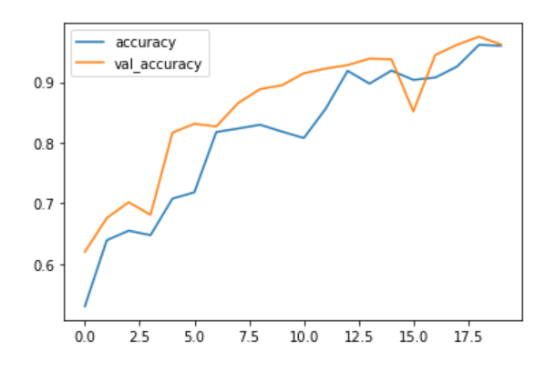

# Natural-Scene-Classifier
Natural Scenery Classifier using CNN

# Data 

The data is fetched from the source: <i>https://www.kaggle.com/puneet6060/intel-image-classification</i>

>## How to get the data:
>
>Follow the above link 
>Download the dataset 
>Place all the three downloaded folders(seg_pred,seg_train,seg_test) in a new folder called data 

# Architecture of the Model

>A conv2D layer with 32 nodes 
>A max pooling layer with a sliding window size of 2x2 
>A flatten layer 
>A hidden dense layer with 128 nodes 
>An output dense layer with 6 nodes with softmax activation function

The model is compiled with adam optimizer with a loss of categorical crossentropy 

The model is trained for 20 epochs.

# Results

Accuracy on training set: <b>96%</b> 
Accuracy on test set: <b>96.23%</b>

